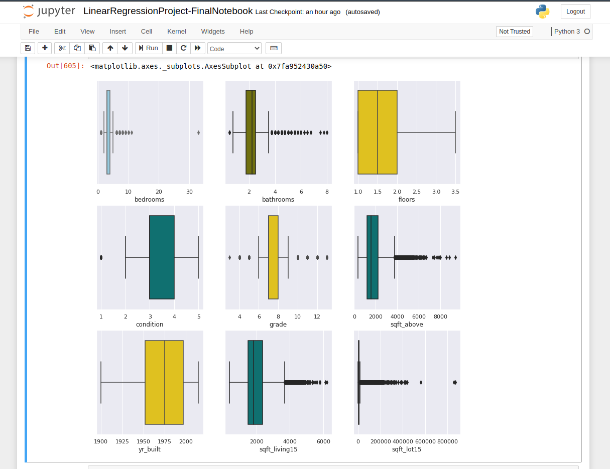
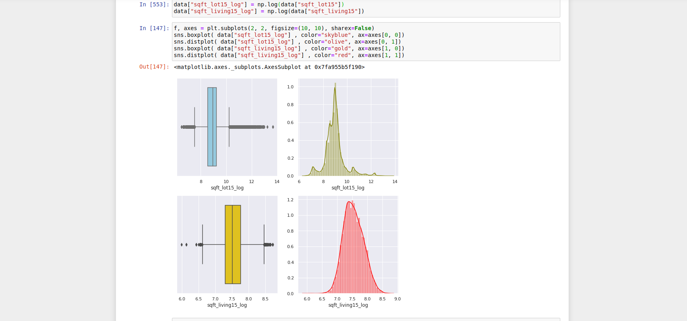

# RegressionAnalysisProject

## Project

Using historical data from property sales in Washington state, USA, I have been ask to analyse and provide insight, as well as complete a number of specific tasks in SQL, Tableau and use Python to build a machine learning model to predict the selling prices of houses based on a variety of features on which the value of the house is evaluated.

## My Approach

I initially approached the project by brainstorming and creating a Kanban board, listing all of the jobs that I thought needed to completed in order to fulfil all the requirements, but was very aware that I would probably encounter a number of problems along the way so wanted to follow Agile methodology to allow for flexibility and continuous improvement.

Project Deliverables

  *  A slides deck: [My Slides](https://docs.google.com/presentation/d/1aU0oN8-odVbOynBnhMiN4cmolKOtC3c3SeO_X2kwP5M/edit?usp=sharing)
  *  A presentation: *Recorded Live*
  * SQL Queries: [My SQL Soultions](https://github.com/surelybassy/RegressionAnalysisProject/blob/master/SQL%20Queries/SQL%20Tasks%20and%20Solutions.md)
  * A Tableau Dashboard: [My Dashboard is Here](https://public.tableau.com/profile/andrew.ashdown#!/vizhome/MidBootcampProject-Story/AA-Mid-BootcampDashboard
)
  * Python code: [My Jupyter Notebook](https://github.com/surelybassy/RegressionAnalysisProject/blob/master/JupyterNotebooks/LinearRegressionProject-FinalNotebook.ipynb)

## SQL

There were a number of tasks and questions to answer in SQL and I decided to start with these, as I was most comforatable using MySQL. For these tasks I used MySQL Workbench. After creating the database, I used the import wizard to import the CSV file and then began to explore the data. My solutions to this can be found in the SQL folder of this repository.

[My SQL Soultions](https://github.com/surelybassy/RegressionAnalysisProject/blob/master/SQL%20Queries/SQL%20Tasks%20and%20Solutions.md)

## The Data

 

After competing the SQL tasks, I moved into Python. I imported the data into a Pandas dataframe and began to explore and analyse the data by using a number of different graphs and plots from Seaborn. This helped to identify features in the dataset the would require special attention during  cleaning and preprocessing.

There were a number of duplicate property IDs for property sold twice within the time period. I decided to only include the most recent sale, as it would give a more accurate picture of the property market in the area at the time.

Using Box Plots, I could see that some of the data was very skewed and would need to think about how to deal with the outliers. There were also several columns containing a significant number of 0 values. 

## Cleaning the Data

## Modelling the Data

## Tableau

## Cleaning the Data

